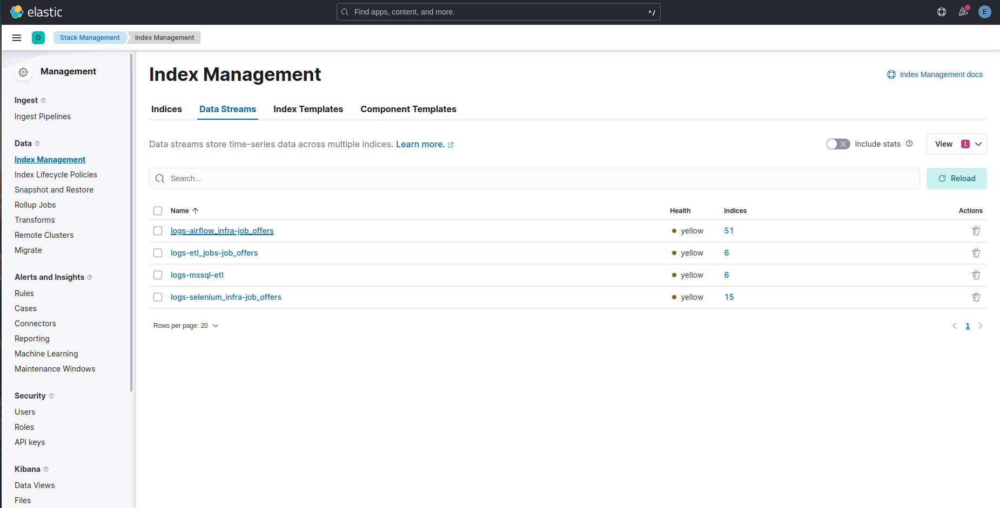
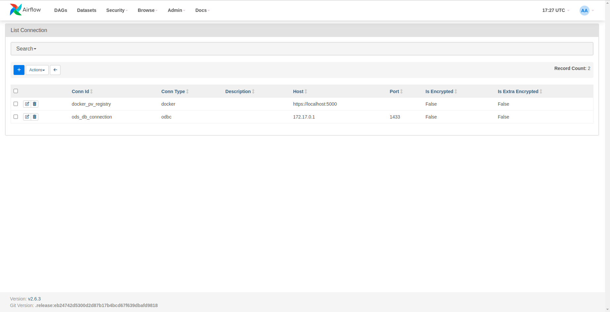

# Infrastructure And Tools
- [Selenium Grid](#selenium-grid)
- [ELK Stack](#elk-stack)
- [Prometheus And Grafana](#prometheus-and-grafana)
- [Apache Airflow](#apache-airflow)
- [Talend Open Studio](#talend-open-studio)

# Selenium Grid
The project utilized Selenium, a web automation tool, to scrape job offers and company details from the HelloWork website. Selenium's remote web driver and Selenium Grid were employed to efficiently navigate and extract data. Multi-threading was implemented to speed up data collection, making the process more time-efficient. Using a 4 node Linux Chrome Drivers : 

#### Selenium Hub Dashboard

# ELK Stack
The project incorporated the ELK Stack to centralize and analyze logs generated from various components. Elasticsearch served as the core storage engine for log data, while Logstash was used for log processing. Kibana provided a user-friendly interface for log visualization and exploration.

**Log Ingestion with Filebeat** Filebeat, a lightweight log shipper, played a critical role in ingesting logs. It collected logs from multiple sources, including SQL Server databases, Selenium Grid, Airflow, and the custom jobs. Filebeat was configured to forward these logs to either Elasticsearch directly through the ingest pipeline or to Logstash for additional processing.

**Log Processing with Logstash** Logstash was employed to process specific logs, such as Airflow metrics and job-related metrics. It acted as a data transformation layer, enhancing the usefulness of the logs before they were stored in Elasticsearch. For example, Logstash processed Airflow metrics for more meaningful visualization and analysis.

**Elasticsearch as the Log Repository** Elasticsearch was selected as the primary storage engine for log data due to its robust indexing and querying capabilities. It offered a scalable and reliable solution for storing logs generated from various project components, including SQL Server databases, Selenium Grid, Airflow, and custom jobs.

#### Sql Server Logs

#### Airflow Logs

#### Selenium Logs

#### Jobs Logs

#### Data Streams

#### Log Policy

# Prometheus And Grafana
**Prometheus for Metric Collection** Prometheus served as the core metric collection tool, continuously gathering data from various project components. It ensured real-time visibility into system metrics, database performance, and custom job-specific metrics, allowing for proactive monitoring.

**Custom Metrics and Exporters** Custom metrics, specific to the project's requirements, were collected and exposed to Prometheus. Custom exporters were developed to facilitate the extraction of these metrics, extending monitoring capabilities beyond standard system metrics.

**Grafana Dashboards** Grafana provided a user-friendly interface for creating and customizing dashboards. The project leveraged both community-provided and custom dashboards, covering a wide range of metrics, including Airflow, cAdvisor, node performance, and database statistics. These dashboards offered comprehensive insights into the project's infrastructure and performance.

**Custom Dashboards** In addition to community dashboards, custom dashboards were designed to monitor specific project components, such as web scraping jobs and the NLP model. These dashboards were tailored to display metrics most relevant to their respective components, facilitating in-depth analysis and troubleshooting.

**mtail for Log-Based Metrics Extraction** mtail played a pivotal role in the project's monitoring strategy by extracting valuable metrics from log files. It was configured to parse log entries and transform them into Prometheus-compatible metrics. This capability extended monitoring to include logs from Talend Jobs into prometheus

#### Prometheus

#### Grafana Node Metrics

#### Grafana Hello Work Scrapping Metrics

#### Grafana Company Scrapping Metrics

#### Grafana C Advisor

#### Grafana Skill Extraction Metrics

# Apache Airflow

**Task Scheduling with Apache Airflow** Apache Airflow was employed to schedule and orchestrate data processing tasks throughout the project. It provided a structured approach to defining workflows, ensuring that tasks executed in a coordinated and timely manner. Tasks included data preprocessing, transformation, and loading into databases.

**Dockerized Execution** To enhance scalability and resource isolation, Docker containers were utilized to execute Airflow tasks. This approach simplified the deployment of task dependencies, ensuring that each task operated within an isolated environment. Docker containers also aided in managing dependencies.

**Custom DAG for Task Flow** A custom Directed Acyclic Graph (DAG) was designed to represent the workflow of tasks. The DAG defined task dependencies and the order in which they were executed. This allowed for the seamless execution of tasks, ensuring that data was processed efficiently.

**Weekly Scheduling** Tasks within the Airflow DAG were scheduled to run weekly, ensuring that data processing activities occurred at regular intervals. This scheduling approach aligned with the project's objectives and provided up-to-date insights into job offers and company details.

**Airflow Stack** The entire Apache Airflow stack, including the web server, scheduler, and worker processes, was containerized using Docker. This containerized approach improved portability and simplified the deployment and scaling of Airflow components.

#### Dag Overview

#### Task

#### Dag Detail

#### Connection Details

# Talend Open Studio

**ETL And Data Preprocessing with Talend** Talend served as a critical component for automating data preprocessing tasks. Raw data collected from web scraping activities was initially channeled into an operational data store (ODS). Talend played a central role in the extraction and ingestion of this raw data into the ODS, ensuring that it was properly prepared for further processing.

**Transformation and Enrichment** Beyond data extraction, Talend was instrumental in transforming and enriching the data This phase encompassed activities such as data cleaning, standardization, and structuring, ensuring that the data was primed for analytical purposes. Using Talend we enriched the data from external sources like the output of the SkillNier Model and using the Data Gouv API to gather information about companies in the transformation phase. 

**Creation of Dimensions for Data Warehouse** A significant highlight of Talend's role in the project was its contribution to creating dimensions for the data warehouse in SQL Server. Talend jobs were meticulously designed to export data from the ODS into dimensions, which are critical components of a data warehouse. These dimensions provided the necessary context and hierarchies for analyzing and reporting on the project's data.

#### Talend Open Studio 

