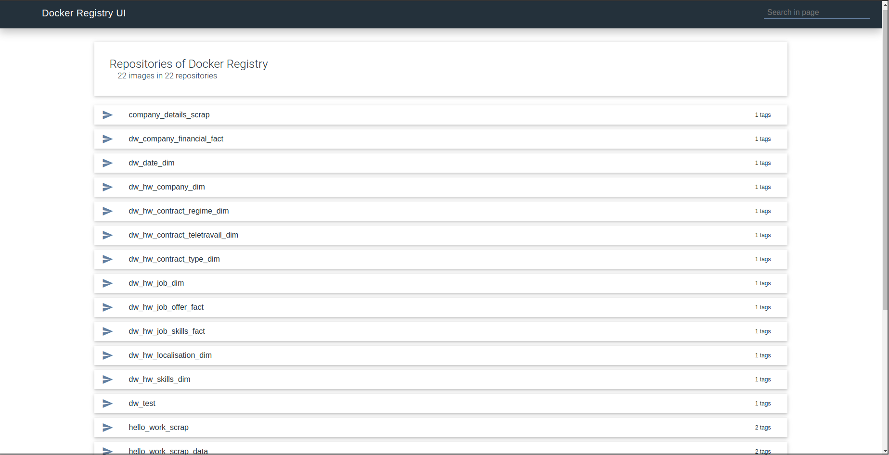
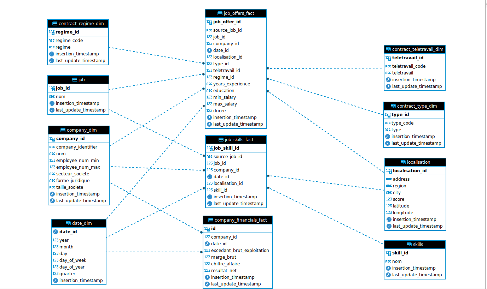

# Overview
This report outlines a data engineering project that focused on web scraping, data processing, and monitoring. The project aimed to gather job-related data and company details from the HelloWork website, extract job skills from job descriptions, and establish a reliable data pipeline and a solid DataWarehouse.

The project included web scraping, NLP-based skill extraction, Docker containerization, data preprocessing with Talend, scheduling with Apache Airflow, monitoring with Prometheus, ELK, and Grafana and data visualization with Power BI..  

#### Hello Work Platform

### Infrastructure and Tools Details

The project's infrastructure and tools create a robust ecosystem for data engineering and analysis. Here's an overview of the key infrastructure components and tools used:

**Infrastructure:**

- **Docker**: Utilized for containerization, simplifying deployment, scalability, and resource isolation.
- **SQL Server**: Serves as the relational database for structured data storage and retrieval.
- **ELK Stack (Elasticsearch, Logstash, Kibana)**: Facilitates log processing, centralization, and interactive log analysis.
- **Selenium Grid**: Empowers parallel web scraping by distributing tasks across multiple nodes.
- **Airflow**: Orchestrates data processing tasks and schedules jobs for automation and reliability.

**Tools:**

- **Prometheus**: Collects real-time metrics, enabling comprehensive monitoring and alerting.
- **Grafana**: Offers customizable dashboards for visualizing system, process, and performance metrics.
- **Talend Open Studio**: Facilitates data preprocessing, transformation, and the creation of dimensions and fact tables.
  
For More Details : check the infrastructure folder

#### Custom Registry used for docker images

### DataWarehouse Details : 

- **ODS Tables**:
  - **Job_Offer_Fact**: Captures job offer-related metrics and details.
  - **Company_Financial_Fact**: Stores financial metrics related to companies.

- **Fact Tables**:
  - **Job_Offer_Fact**: Captures job offer-related metrics and details.
  - **Company_Financial_Fact**: Stores financial metrics related to companies.

- **Dimension Tables**:
  - **Company_Dim**: Provides comprehensive company information.
  - **Localisation_Dim**: Offers geographical context.
  - **Contract_Type_Dim**: Categorizes job contracts by type.
  - **Contract_Teletravail_Dim**: Focuses on telecommuting contract details.
  - **Contract_Regime_Dim**: Categorizes employment types.
  - **Skills_Dim**: Lists skills extracted from job descriptions.
  - **Job_Dim**: Contains structured job-related attributes.
  - **Date_Dim**: Facilitates time-based analysis.

#### DW Model : 

### Jobs Details :

Created Talend Jobs for ETL and Data Extraction And Enhancment jobs using python : 

**Python Jobs:**

- **hello_work_scrap**: Multithreaded Web Scrapping for the job offers from the hello work platform
- **company_details_scrap**: Multithreaded Web Scrapping for the company details using the french GOV Api 
- **skill_extractor**: SkillNier Model for extracting skills from job descriptions

**Talend Java Jobs:**

1. **DW_HW_Company_Dim**: This job is responsible for creating the dimension table for company-related data within the data warehouse, providing a comprehensive view of company information.

2. **DW_HW_Localisation_Dim**: This job focuses on building the dimension table for geographical location data, offering context for job offers and companies.

3. **DW_HW_Job_Offer_Fact**: This job creates the fact table in the data warehouse to capture job offer-related metrics and information, facilitating analytical insights into job postings.

4. **DW_HW_Contract_Type_Dim**: It's responsible for generating the dimension table that categorizes job contracts by type, enabling detailed contract analysis.

5. **DW_HW_Contract_Teletravail_Dim**: This job constructs a dimension table specific to telecommuting contract details, enhancing remote work-related analytics.

6. **DW_HW_Contract_Regime_Dim**: This job builds a dimension table for contract regime information, aiding in the categorization of employment types.

7. **ODS_HW_Load_Data**: This job focuses on loading data from raw files into the operational data store (ODS) for further processing and transformation.

8. **DW_HW_Job_Skills_Fact**: It's responsible for creating the fact table that captures job skills data, facilitating analysis of required skills across job postings.

9. **DW_HW_Skills_Dim**: This job constructs the dimension table for skills, providing a comprehensive list of skills extracted from job descriptions for analysis.

10. **DW_HW_Job_Dim**: This job's purpose is to create the dimension table for job-related data, offering a structured view of job attributes.

11. **ODS_HW_Preprocess_Data**: It handles the preprocessing of data within the ODS, ensuring that data is cleansed and transformed before being moved to the data warehouse.

12. **DW_Date_Dim**: This job generates the dimension table for date-related information, facilitating time-based analysis and reporting.

13. **DW_Company_Financial_Fact**: This job is responsible for creating the fact table capturing financial metrics related to companies, enabling financial analysis within the data warehouse.

### Power BI Details

We've integrated Power BI for easy data visualization, offering:

- **General Overview Dashboard**: Get a quick snapshot of project data.
- **Skills Reports**: Dive deep into job skills and trends.
- **Companies Reports**: Explore detailed company and financial insights.
- **Job Offers Reports**: Get detailed data on job postings, salaries, and locations.

#### Power Bi Report

